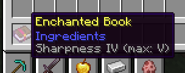

## Enchant Tooltips

A mod for Fabric 1.20.4+ which adds more customization to enchantment tooltips:

- Appends the maximum enchantment level to the end of the tooltip
- Adds the option to use literal numbers instead of roman numerals

All options in this mod are fully configurable through the GUI provided by [Cloth Config](https://modrinth.com/mod/cloth-config), 
which can be opened through [Mod Menu](https://modrinth.com/mod/modmenu).

### Download

You can get this mod from [Modrinth](https://modrinth.com/mod/enchant-tooltips),
or [GitHub Releases](https://github.com/caoimhebyrne/enchant-tooltips).

### Contributing

Anyone can contribute to this mod, as long as they take note of the [MIT license](LICENSE).

For language translations, open a pull request which adds/changes a language file in `assets/enchant-tooltips/lang`.

#### Supported Languages

- English (US) [complete]
- English (GB) [complete]
- Nederlands (Dutch) [complete]
- Português (Brasil) (Brazilian Portuguese) [complete]
- Lolcat (US) [complete]
- Gaeilge (Irish) [partial]